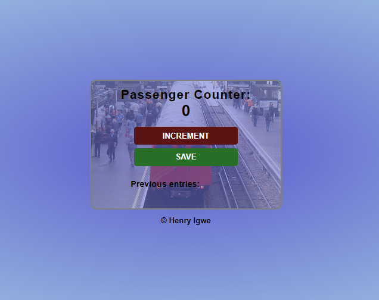

# ABOUT MY PROJECT

## Passenger Counter
This project is used to count passengers as they board the train. It ensures precision and accuracy is number.

### Built with

HTML
CSS
JAVASCRIPT

### Contact
Twitter: https://twitter.com/IgweHenr1

LinkedIn : https://linkedin.com/in/henryigwe

Projectlink: https://mypassenger-counter.netlify.app/

### Acknowledgement 
